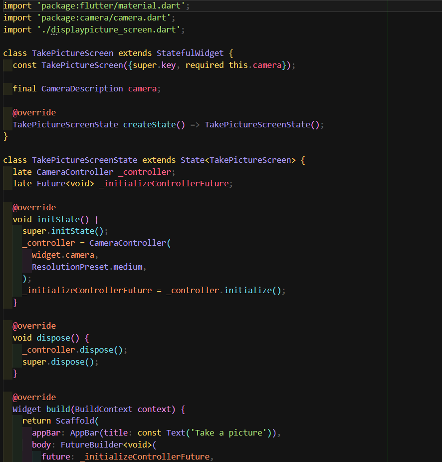
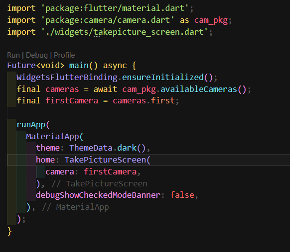

# camera

# Filter

# Display

# Main Page

# Result

## Jelaskan maksud void async 

Kalau sebuah fungsi `void` diberi keyword `async`, artinya isi fungsi itu bisa jalan sambil menunggu tugas lain selesai, misalnya ambil foto atau simpan file. Kita bisa pakai `await` di dalamnya supaya proses tersebut ditunggu dulu, tapi aplikasi tetap responsif dan tidak berhenti. Setelah tugasnya selesai, fungsi `async` otomatis memberi tahu lewat `Future<void>` bahwa pekerjaannya sudah selesai.

## Jelaskan fungsi dari anotasi @immutable dan @override ?

`@immutable` dipakai untuk menandai sebuah class bahwa semua propertinya seharusnya tidak berubah setelah objek dibuat. Biasanya dipakai di Flutter supaya widget tetap bersifat stateless dan mudah dikelola.

`@override` dipakai saat kita menulis ulang method atau getter/setter yang sudah ada di class induk. Dengan anotasi ini, compiler tahu kita memang sengaja mengganti perilaku bawaan dan bisa memberi peringatan jika tanda tangan method tidak cocok.